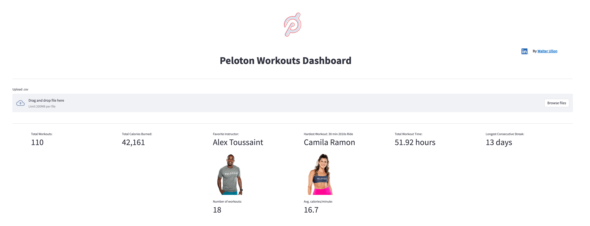
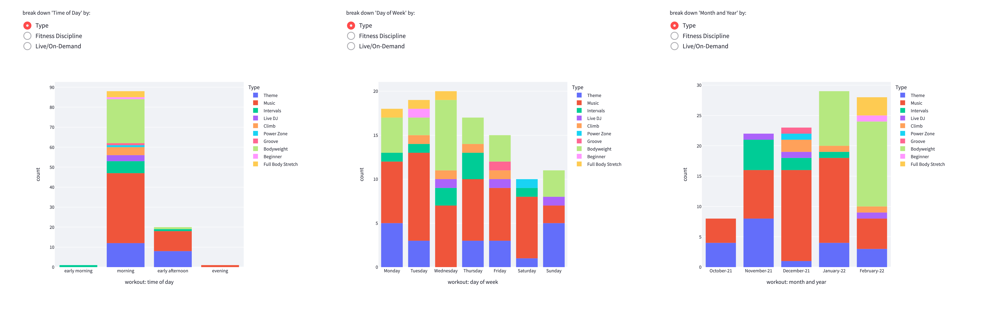
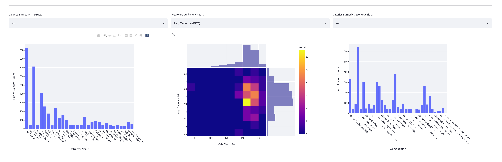
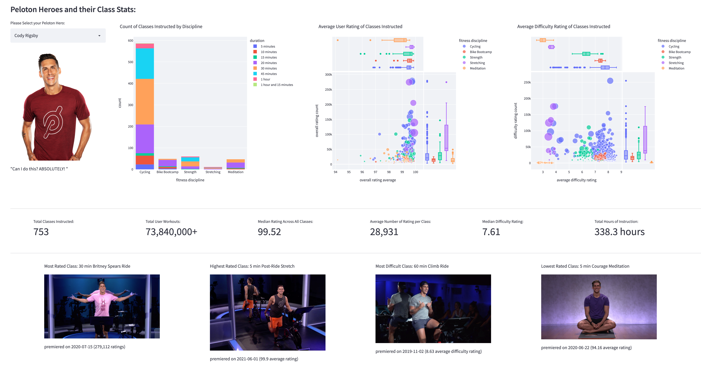

# Peloton Workouts Dashboard
Peloton dashboard app built with Plotly and Streamlit.

Built it primarily as a personal tool to keep track of my progress at an aggregated level.

I eventually, I added the functionality for users to upload their own workouts data and made use of Peloton's API to get global statistics on their instructors/

I made the app publicly available through https://mypelotondashboardapp.com. However, Peloton made me take it down...🤣

### Usage:
To run this locally, you'll need your own Peloton app credentials (your member name and password). Enter these at the top of the api_functions.py file.

Run the app by calling the peloton_dash.py file and enterign the resulting command line into your terminal.

## Enjoy!
